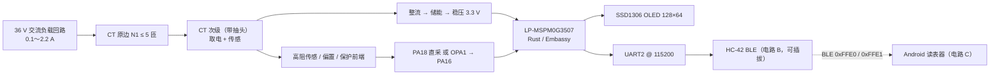

# 无源交流电流表及无线读表器

> **Passive AC Ammeter and Wireless Reader** — 2026 年全国大学生电子设计竞赛（TI 杯）B 题作品

自制“无源”交流电流表与无线读表系统。电流表以电流互感器（CT）电磁耦合取电并同时完成电流传感
（题目规定的唯一供电方式），由 TI MSPM0G3507（LP-MSPM0G3507 开发板）运行 Rust 裸机固件，
实现自动量程、真有效值测量、OLED 显示与 HC-42 BLE 无线上报；读表器端为 Android App，通过
BLE 读取一个或多个电流表，完成手动/自动采集、低限/超限/离线报警、历史存储与趋势显示。

##作品实物图
<div style="text-align: center; margin: 20px 0;">
  
</div>


## 系统组成



## 仓库结构

| 路径 | 内容 |
| --- | --- |
| `src/` | 电流表固件（Rust，`#![no_std]`，Embassy；含片内标定存储 `nvcal.rs`） |
| `src/bin/` | 附加固件：`stream`、`btcfg`、`oparails` |
| `android-reader/` | 无线读表器 Android App（Kotlin / Gradle，含标定台） |
| `xtask/` | 主机侧测试工具：示波器（SDS2102X Plus）、万用表（SDM3055X-E）、标定采集 `cal-log` |
| `docs/` | 硬件参考手册：HC-42 规格书、LP-MSPM0G3507 板卡资料、MSPM0G TRM |
| `STRUCTURE.md` | DSP 流程与固件设计要点（中文，含各模块取舍） |
| `cal.csv` | 分档标定表（LSB → A，分段线性查表） |
| `app-prototype.html` | 读表器界面单文件原型（本地模拟数据） |

## 电流表固件

### 硬件平台与引脚

| 功能 | 引脚 | 说明 |
| --- | --- | --- |
| OLED（SSD1306 128×64） | PB2 = SCL，PB3 = SDA | 软件 I2C 位带驱动 |
| 板载 LED1 | PA0 | 电源轨就绪后 3 Hz 闪烁（就绪指示） |
| 测量触发按键 S2 | PB21 | 低有效，与蓝牙 `MEAS` 命令完全等价 |
| 4 位地址拨码开关 | PB0 / PB6 / PB7 / PB8 | 低有效，运行时每帧重读，无需重启 |
| HC-42 电源控制 | PB17 | 需外部下拉定住上电前的空闲电平 |
| HC-42 UART2 | TX = PB15，RX = PB16 | 115200 8N1 |
| 外部电路控制 | PA8 / PA26 | 互补 PWREN：测量态 PA8 高 + PA26 低，空闲态相反 |
| 模拟输入 | PA18（x1 直采）/ PA16（OPA1 输出） | ADC1.3 / ADC1.1 |
| 基准 | PA23（VREF+） | 2.5 V 内部基准，必须外接 1 µF CVREF |

### 一次完整测量（`meter::measure`）

所有触发源（上电自测、按键、`MEAS` 命令、定时器）走同一条路径，两个固件共用同一份测量代码，
因此一张标定表在两边都成立：

1. **探测帧**：ADC1.3 直采 PA18（x1），160 点 / 40 ms → 输入端的 mean、峰峰值；
2. **选档**：取使 `G·pp/2 ≤ 65%` 可用余量的最大档 → `G ∈ {1, 2, 4, 8, 16, 32}`；
3. **定偏置**：`Vdac = (C − G·mean) / (1 − G)`，`C = 2047` → 输出直流落回窗口中心；
4. **主帧**：4 ksps × 800 点 = 10 个 50 Hz 周期 → ADC1.1（OPA1_OUT）或 ADC1.3（x1）；
5. **RMS**：Hann 加权，减本帧均值 → `f32` LSB；
6. **标定**：按档查 `cal.csv`，分段线性 → `f32` A。

测量结束立即按“下游 → 上游”顺序掉电（TIMG6/ADC1 → OPA1/DAC12 → 外部电路回空闲态），
两次测量之间不留下任何模拟负载。

### 关键设计点

- **自动量程 + DAC 偏置枢轴**：x1 是一个真档而不是特例——2x 起把直流也放大，输入直流偏低时
  PGA 各档够不着量程顶端，只有 x1 装得下。DAC12 与 ADC 共用 2.5 V 基准，`dac_code_for`
  直接由 ADC 码解出 DAC 码。
- **撞轨检测**：探测帧撞到 ADC 两端、或连 x1 都装不下时打质量标记，不静默出数。
- **电源门**：上电后不使能任何模拟块、不给射频上电，先轮询 ADC0 内部监视直到 VDD ≥ 3.3 V
  （`BOOT_MIN_MV`），无超时。轨没到就一直暗着等。
- **上电先读一次**：射频上电前先完成一次完整采集，端口一开就把读数发出去。
- **请求不排队**：测量期间的按键 / 命令一律丢弃，一次读数只回答发起它的那个请求。
- **心跳**：空闲时每 2 s 发 `IMHERE,ADDR=n`，读表器据此发现/离线判断，拨码拨动即生效。
- **质量标志**：`RefBad` / `BadInput` / `OverRange` / `Partial` / `Good`，坏读数不进标定表。

### 固件二进制

| 二进制 | 作用 |
| --- | --- |
| `passive-ac-ammeter-and-wireless-reader`（默认） | 单次测量：上电等轨 → 自测一次 → 之后按键或 `MEAS` 触发，结果先发帧再刷屏 |
| `stream` | 定时自测自发（`METER_TEST` + `METER_CAL` 两行），供产线/标定监控 |
| `btcfg` | 配置 HC-42（如 `AT+UART=115200`）并回读确认 |
| `oparails` | 用 DAC 当激励扫描 OPA1 的轨到轨特性（复测工具） |

### 无线协议（HC-42 透传）

命令方向（下行，故意不用 `METER_*` 打头，避免被自己的回显触发）：

```text
MEAS                    # 广播：范围内所有表都测
MEAS,ADDR=n             # 只有地址拨码等于 n 的表响应
CALPT,ADDR=n,I=i,X=lsb,Y=amps   # 标定：暂存一个点（不落盘）
CALEND,ADDR=n,N=count   # 标定：安装暂存点，写入片内 flash
CALOFF,ADDR=n           # 标定：清除现场表，回到内置 ROM 表
CALGET,ADDR=n           # 标定：查询当前用哪张表
```

`CAL*` 命令只认指定地址，没有广播形式——一张表只能推给它实测出来的那块表。

上报方向（上行，每行 CRLF 结尾）：

```text
METER_TEST,ADDR=01,CURRENT_MA=1234,STATUS=NORMAL
METER_CAL,ADDR=01,RMS=0.12,GAIN=1,FLAG=OK,SRC=ROM,MEAN=...,PP=...
IMHERE,ADDR=01
CALACK,ADDR=01,I=5            # 应答 CALPT，出错时带 ERR=...
CALSTAT,ADDR=01,SRC=ROM,N=16  # 应答 CALEND / CALOFF / CALGET
```

`STATUS` 分类：`< 200 mA` 为 `LOW`，`> 2000 mA` 为 `HIGH`，其余 `NORMAL`（赛题报警阈值）。
`METER_CAL` 携带原始 RMS、档位、质量标志与标定来源（`SRC=ROM` 内置表 / `SRC=FIELD` 现场表），
供 `xtask cal-log` 采集标定。`METER_TEST` 是 Android 端解析的帧（正则锚定行尾），不可追加字段。

## 无线读表器（Android）

App 见 [android-reader/README.md](android-reader/README.md)，功能要点：

- 启动自动搜索并连接发现的第一个 HC-42，无需设备列表操作；
- **基本模式**：一对一，点“手动读取”采集下一帧；
- **自动模式**：一键启动，搜索覆盖范围内名称匹配的全部电流表，默认每 2 分钟自动采集一轮
  （可在 10 s / 30 s / 1～5 分钟间设置并持久保存），通知栏倒计时；
- 地址码切换 `00`～`15`（电流表侧拨码设置，App 不下发控制命令）；
- SQLite 持久保存最近 1000 条记录（读取时间、地址、电流值、正常/低限/超限/离线状态）；
- 历史列表（最近 50 条）与趋势曲线（最近 120 条，双指缩放时间轴/电流轴）；
- 报警与离线指示（`< 0.2 A` 低限、`> 2 A` 超限、负载断开离线）。

固定通信参数：BLE Service `0000FFE0-0000-1000-8000-00805F9B34FB`，Notify Characteristic
`0000FFE1-0000-1000-8000-00805F9B34FB`，自动采集周期 120 s，单轮扫描窗口 8 s。

## 构建与运行

### 电流表固件

工具链：Rust `1.97.1`，target `thumbv6m-none-eabi`，Embassy 使用固定 rev 的 fork
（`ozongzi/embassy`，见 `Cargo.toml`）。烧录由 `.cargo/config.toml` 的 runner 完成：

```sh
cargo build --release
cargo run --release    # pyocd flash --target mspm0g3507 --format elf
```

运行依赖 `pyocd` 与 TI MSPM0G 器件包。注意事项：

- HC-42 必须与固件 `BT_BAUD_RATE = 115200` 匹配（`btcfg` 可设置并回读）；模块留在出厂
  9600 不会变慢，而是直接静默；
- PB17 需外部下拉，否则烧录/复位窗口内射频会提前上电；
- OLED 的 PB2/PB3 是模板固定引脚，使用前确认不与其它外设冲突；
- 2.5 V 档要求 VDD ≥ 2.7 V（VREF 规格），自制板需照抄 LP 板的 CVREF（1 µF 于 VREF+/VREF−）。

### Android App

需要 JDK 17、Android SDK Platform 35 与 Build Tools 35：

```powershell
cd android-reader
gradle assembleDebug
```

调试 APK 输出到 `android-reader/app/build/outputs/apk/debug/app-debug.apk`。

### 标定与测试工具

标定采集、示波器和万用表工具都在 `xtask`（主机侧，`cargo xtask`）：

```sh
cargo xtask cal-log --out cal-x32.csv    # 自动发 MEAS 驱动电流表，每帧配一次 DMM 读数写 CSV
cargo xtask cal-log --list-ble           # 枚举蓝牙设备
cargo xtask cal-log --list-dmm           # 列出 VISA/USBTMC 仪器
cargo xtask scope-shot                   # 示波器截图（SDS2102X Plus）
cargo xtask scope-dump C1                # 波形导出 CSV
cargo xtask scope-query <SCPI>           # 原始 SCPI 查询
```

`cal-log` 的详细参数（扫描秒数、地址、万用表连接方式、取数 SCPI 等）见
`cargo xtask cal-log --help`。注意标定时对着 `main` 固件用，`stream` 固件会自行定时测量、
跟它抢链路。

## 文档

- [STRUCTURE.md](STRUCTURE.md) — DSP 流程与固件设计要点
- `docs/HC42.pdf` — HC-42 蓝牙透传模块规格书
- `docs/LP-MSPM0G3507_开发板信息.md` — LP-MSPM0G3507 开发板资料
- `docs/slau846-g-series-trm.pdf` — MSPM0G 系列技术参考手册（TRM）

## 许可证

专有许可，见 [LICENSE-PROPRIETARY](LICENSE-PROPRIETARY)。未经著作权人书面许可，不得复制、
修改、发布、分发或再许可本仓库源码。
