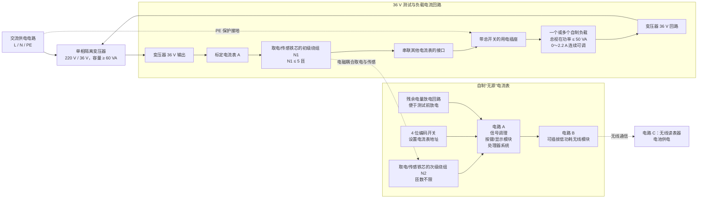

# 2026 年全国大学生电子设计竞赛赛区赛（TI 杯）

## “无源”交流电流表及无线读表器（B 题）题目信息汇总

> 赛事：2026 年全国大学生电子设计竞赛赛区赛（TI 杯）暨模拟电子系统设计专题赛选拔赛
>
> 题目：B 题——“无源”交流电流表及无线读表器
>
> 原始题面：[题面.pdf](题面.pdf)
>
> 本文按原题面逐项整理。指标、限制条件和分值以原始 PDF 为准。

## 1. 任务概述

设计并制作一套用于低压配电网的电流表及无线读表系统，用来监视供电电路的运行情况。

- **自制“无源”交流电流表**：必须采用题目规定的电磁耦合方式取电，不得采用其他方式供电；完成交流电流有效值测量、处理与显示。
- **无线读表器**：通过无线方式读取一个或多个电流表的数据，完成手动/自动采集、报警、数据保存、历史查看和趋势显示。
- 系统主要分为：
  - **电路 A**：信号调理、按键/显示模块及处理器系统；
  - **电路 B**：电流表端的可插拔低功耗无线模块；
  - **电路 C**：电池供电的无线读表器。

## 2. 系统框图

下图依据原题图 1 重绘，保留供电回路、取电/传感、电流表电路、无线读表器及测试接口之间的关系。

### 2.1 各部分作用

| 部分 | 作用及约束 |
| --- | --- |
| 单相隔离变压器 | 将 220 V 隔离变换为 36 V；容量 60 VA |
| 标定电流表 A | 作为自制电流表精度测试时的比对仪器 |
| 取电/传感铁芯及绕组 | 初级绕组 `N1 ≤ 5` 匝；次级绕组 `N2` 匝数不限；通过电磁耦合为电流表取电并感知负载电流 |
| 电路 A | 信号调理、按键/显示和处理器系统；拔除电路 B 后仍须正常工作 |
| 电路 B | 电流表端可插拔、低功耗无线传输模块 |
| 电路 C | 电池供电的无线读表器，负责读取、报警、存储、历史查看和趋势显示 |
| 其他电流表接口 | 供其他电流表串入测试回路 |
| 用电插座及负载 | 插座总开关须能断开全部负载；负载总视在功率不超过 50 VA，电流 0～2.2 A 连续可调 |

## 3. 自制“无源”电流表要求

### 3.1 供电、结构与接口

1. 电路 A 和电路 B 必须采用电磁耦合方式获取电能，且这是本电流表的**唯一供电方式**。
2. 取电传感部分的初级绕组匝数满足 `N1 ≤ 5`。
3. 初级线圈绕组必须在作品中清晰可见，能够检查和核对匝数。
4. 次级绕组 `N2` 的匝数不限制。
5. 电流表上须设置 **4 位编码开关**，用于设置电流表地址编号。
6. 电路 B 须采用可插拔的低功耗无线传输模块。
7. 拔除电路 B 后，电路 A 必须能够正常工作；不要求支持热插拔。
8. 电路 A 须设置便于操作的残余电量放电回路，供部分项目测试前放电。
9. 自制电流表须留有串联其他电流表的接口。

### 3.2 测量性能

| 指标 | 要求 | 分值 |
| --- | --- | ---: |
| 测量范围 | `0.1～2 A` |  |
| 显示量 | 交流电流有效值 |  |
| 测量误差 | 与标定电流表读数相比，**相对误差的绝对值 `≤ 0.5%`** | 30 |
| 启动电流 | 在低功耗设计基础上，电流表启动工作所需的负载电流越小越好 | 20 |
| 启动时间 | 越短越好 | 20 |

### 3.3 启动指标定义

- **启动电流**：在最小用电负载情况下，电流表能够启动工作时所对应的负载电流。
- **启动时间**：在启动电流的工作条件下，从负载接通到电流表正常工作所需的时间。

> 题目没有给出启动电流和启动时间的固定合格阈值，采用“越小越好”和“越短越好”的竞争性评价方式。

## 4. 无线读表器要求

读表器对应电路 C，通过无线方式读取电流表数据；功耗不作严格要求，使用电池供电。

### 4.1 无线读取距离

- 读取距离：`≥ 5 m`。（3 分）

### 4.2 数据读取模式

读表器须同时支持基本模式和自动模式。（10 分）

| 模式 | 功能要求 | 操作限制 |
| --- | --- | --- |
| 基本模式 | 一对一、手动读取电流表读数 | 不操作电流表；允许操作读表器 |
| 自动模式 | 自动搜索无线覆盖范围内的电流表；每 2 分钟自动采集一次；读表器一键启动 | 电流表除地址码设置外，不得操作其他功能键 |

### 4.3 报警与离线指示

读表器须具备以下报警指示功能。（5 分）

| 状态 | 判定条件 | 指示要求 |
| --- | --- | --- |
| 低限 | 负载电流 `< 0.2 A` | 低限报警 |
| 正常 | `0.2 A ≤ 负载电流 ≤ 2 A` | 题目未规定专门报警 |
| 超限 | 负载电流 `> 2 A` | 超限报警 |
| 离线 | 负载断开 | 离线指示 |

### 4.4 数据记录、历史与趋势

读表器须具备以下能力。（8 分）

1. 数据存储；
2. 查看历史数据；
3. 显示电流变化趋势曲线；
4. 每条数据记录至少包含：
   - 读取时间；
   - 电流表编号或地址；
   - 电流值；
   - 是否超限；
5. 至少能存储 **30 条**信息；
6. 数据具有掉电保护功能。

### 4.5 外形与实现形式

1. 读表器外形尺寸不得超过 `12 cm × 7 cm × 5 cm`（长 × 宽 × 高）。
2. 无线传输方式不限。
3. 允许使用手机或平板电脑替代专用读表器，但：
   - 交作品时须与作品一起封存；
   - 不得在手机或平板电脑上额外安装部件。
4. 不得使用笔记本电脑作为读表器。

## 5. MCU 与无线模块限制

### 5.1 MCU

1. 电流表和无线读表器只允许使用 **TI MSPM0 系列 MCU**，具体型号不限。
2. MCU 芯片必须裸露，方便检查。
3. 电路板不得遮挡或擦除 MCU 原型号丝印。

### 5.2 无线模块

1. 电路 B 和电路 C 中的无线通信模块可以内含非 TI 公司的 MCU。
2. 无线模块必须是独立电路板，并且方便插拔。
3. 模块拔除后，其他部分除无线传输功能失效外均须正常工作。
4. 不要求实现热插拔。

## 6. 测试条件与标定仪器

### 6.1 测试电源和负载

| 项目 | 要求 |
| --- | --- |
| 单相隔离变压器变比 | `220 V:36 V` |
| 单相隔离变压器容量 | `60 VA` |
| 自制负载总视在功率 | `≤ 50 VA` |
| 负载电流调节范围 | `0～2.2 A`，连续可调 |

### 6.2 标定电流表 A

标定电流表可采用以下市售仪器之一：

- 不少于 `4½` 位的手持数字万用表；
- 不少于 `4½` 位的台式数字多用表；
- 交流钳形电流表。

标定仪器的最小显示分辨率须 `≤ 1 mA`。赛区测试时可以自带标定电流表，不需要随作品一起封存。

## 7. 电气安全要求

本装置涉及交流 220 V 供电，必须满足以下要求：

1. 系统设计和制作符合电气规范；
2. 强电部分电路做好绝缘处理；
3. 操作符合安全规范，确保人身安全；
4. 负载插座选用带安装开关的用电插座改装；
5. 插座开关能够断开所有负载；
6. 系统采用题目规定的 220 V/36 V 单相隔离变压器。

## 8. 评分标准

### 8.1 设计报告：20 分

| 项目 | 主要内容 | 满分 |
| --- | --- | ---: |
| 系统方案 | 方案描述、系统规划 | 3 |
| 理论分析与计算 | 交流电流有效值的数字测量方法及理论计算；无线读表器和“无源”电流表通信协议 | 6 |
| 电路与程序设计 | 硬件电路设计制作、软件设计、系统流程图 | 6 |
| 测试方案与测试结果 | 测试方案与测试条件、测试结果及完整性、测试结果分析 | 3 |
| 设计报告结构及规范性 | 摘要、设计报告正文结构、图表规范性 | 2 |
| **合计** |  | **20** |

### 8.2 功能与指标：100 分

| 对应要求 | 评分内容 | 满分 |
| --- | --- | ---: |
| 第 1（1）项 | 测量范围、有效值显示和测量精度 | 30 |
| 第 1（2）项 | 电路 A 低功耗设计及低启动电流 | 20 |
| 第 1（3）项 | 启动时间 | 20 |
| 第 2（1）项 | 无线读取距离 | 3 |
| 第 2（2）项 | 基本模式和自动模式 | 10 |
| 第 2（3）项 | 报警及离线指示 | 5 |
| 第 2（4）项 | 存储、历史数据、趋势曲线和掉电保护 | 8 |
| 其他 | 原题未进一步说明 | 4 |
| **合计** |  | **100** |

**总分：120 分。**

## 9. 关键指标速查

| 类别 | 关键要求 |
| --- | --- |
| 电流测量 | `0.1～2 A`，显示有效值，相对误差绝对值 `≤ 0.5%` |
| 唯一供电方式 | 电路 A、B 通过电磁耦合获取电能 |
| 初级绕组 | `N1 ≤ 5`，绕组清晰可见且匝数可查 |
| 地址设置 | 4 位编码开关 |
| 电路 B | 低功耗、独立板、可插拔；拔除后电路 A 正常工作 |
| 无线距离 | `≥ 5 m` |
| 自动采集 | 自动搜索；每 2 分钟采集一次；读表器一键启动 |
| 报警阈值 | `< 0.2 A` 低限报警；`> 2 A` 超限报警；负载断开后离线指示 |
| 数据记录 | 至少 30 条，含时间、地址/编号、电流值、是否超限；支持掉电保护 |
| MCU | 电流表和读表器仅限 TI MSPM0 系列，芯片裸露且型号丝印不可遮挡/擦除 |
| 无线模块 MCU | 可使用非 TI MCU，但模块须独立、可插拔 |
| 读表器尺寸 | `≤ 12 cm × 7 cm × 5 cm` |
| 测试电源 | 隔离变压器 `220 V:36 V`、`60 VA` |
| 负载 | 总视在功率 `≤ 50 VA`；`0～2.2 A` 连续可调 |
| 标定表 | 不少于 `4½` 位或符合题意的交流钳形电流表；最小显示分辨率 `≤ 1 mA` |
| 安全 | 220 V 强电绝缘；规范操作；插座总开关能断开全部负载 |

## 10. 参赛注意事项

1. 7 月 29 日 8:00 竞赛正式开始。
2. 每支参赛队可在赛区发布题目中任选一题，必须在竞赛第一天将选题上报赛区组委会。
3. 参赛队中有本科生成员即为本科参赛队；建议赛区对本科组和高职高专组分开评审及评奖。
4. 参赛队须认真填写《登记表》，填写后交赛场巡视员暂时保存。
5. 参赛者必须是有正式学籍的全日制在校本科、专科学生，并应随时备有可证明学生身份的有效证件。
6. 每队严格限制 3 人，开赛后不得中途更换队员。
7. 竞赛期间可以使用各种图书资料和网络资源，但：
   - 不得在学校指定竞赛场地外进行设计制作；
   - 不得以任何方式与他人交流；
   - 包括教师在内的非参赛队员必须回避；
   - 违纪参赛队取消评审资格。
8. 8 月 1 日 20:00 竞赛结束，上交设计报告、制作实物及《登记表》，由专人封存。

## 11. 验收检查清单

### 电流表

- [ ] 电路 A、B 均只由电磁耦合取电
- [ ] `N1 ≤ 5`，绕组可见、匝数可查
- [ ] 设有 4 位编码开关
- [ ] 电路 B 为独立、低功耗、可插拔无线板
- [ ] 拔除电路 B 后电路 A 正常工作
- [ ] 设有方便操作的残余电量放电回路
- [ ] 留有串联其他电流表的接口
- [ ] 测量范围覆盖 `0.1～2 A`
- [ ] 显示交流电流有效值
- [ ] 相对误差绝对值 `≤ 0.5%`
- [ ] 已尽量降低启动电流并缩短启动时间

### 读表器

- [ ] 无线读取距离 `≥ 5 m`
- [ ] 支持基本模式的一对一手动读取
- [ ] 支持自动搜索和每 2 分钟自动采集
- [ ] 自动模式可在读表器端一键启动
- [ ] 自动模式不要求操作电流表的其他功能键
- [ ] 支持低限、超限报警和离线指示
- [ ] 支持数据存储、历史查看和趋势曲线
- [ ] 单条记录包含时间、地址/编号、电流值和超限状态
- [ ] 可保存不少于 30 条记录
- [ ] 数据掉电不丢失
- [ ] 尺寸不超过 `12 cm × 7 cm × 5 cm`，或采用符合限制的手机/平板方案

### 器件、测试与安全

- [ ] 电流表和读表器 MCU 均为 TI MSPM0 系列
- [ ] MCU 裸露，型号丝印清晰且未被遮挡或擦除
- [ ] 无线模块是独立、可插拔电路板
- [ ] 强电部分已可靠绝缘
- [ ] 负载插座总开关可断开全部负载
- [ ] 使用 `220 V:36 V / 60 VA` 单相隔离变压器
- [ ] 自制负载总视在功率 `≤ 50 VA`
- [ ] 负载电流可在 `0～2.2 A` 范围内连续调节
- [ ] 标定电流表规格及分辨率符合要求
