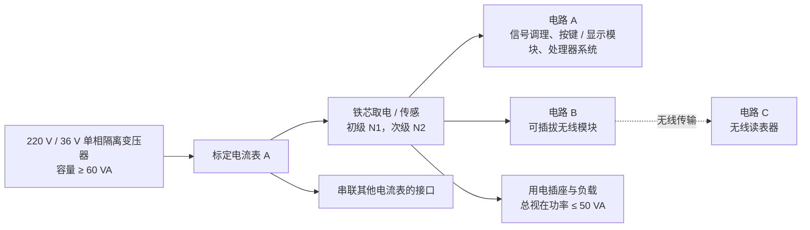

# 2026 年全国大学生电子设计竞赛赛区赛（TI 杯）

## 暨模拟电子系统设计专题赛选拔赛赛题

> 赛题：“无源”交流电流表及无线读表器（B 题）
>
> 来源：`B题_“无源”交流电流表及无线读表器.pdf`
>
> 仓库内原始文件：`docs/题面.pdf`
>
> 本文按原题面整理，数值、限制条件和分值均以原 PDF 为准。

## 参赛注意事项

1. 7 月 29 日 8:00 竞赛正式开始。每支参赛队可在赛区发布题目中任选一题，必须在竞赛第一天将竞赛选题上报赛区组委会。参赛队中有本科生成员即为本科参赛队，建议赛区对本科组参赛队和高职高专组参赛队分开评审及评奖。
2. 参赛队认真填写《登记表》内容，填写好的《登记表》交赛场巡视员暂时保存。
3. 参赛者必须是有正式学籍的全日制在校本、专科学生，应出示能够证明参赛者学生身份的有效证件（如学生证）随时备查。
4. 每队严格限制 3 人，开赛后不得中途更换队员。
5. 竞赛期间，可使用各种图书资料和网络资源，但不得在学校指定竞赛场地外进行设计制作，不得以任何方式与他人交流，包括教师在内的非参赛队员必须回避，对违纪参赛队取消评审资格。
6. 8 月 1 日 20:00 竞赛结束，上交设计报告、制作实物及《登记表》，由专人封存。

## 一、任务

设计并制作一套可用于低压配电网的电流表及其读表系统。

- 自制的电流表（下简称“电流表”）必须采用题图所示的电磁耦合方式供电，不得采用其他方式供电。
- 自制的读表系统（下简称“读表器”）采用无线方式读取电流表数据，用于监视供电电路的运行情况。

### 系统关系

## 二、要求

### 1. 自制“无源”电流表

电路 A 和电路 B 须采用电磁耦合方式获取电能，且该方式是本电流表的唯一供电来源。

- 取电传感部分初级绕组匝数 `N1 ≤ 5`。
- 初级线圈的绕组在作品中必须清晰可见，匝数可查。
- 次级绕组匝数不限制。
- 电流表上设置 4 位编码开关，用于设置电流表地址编号。
- 电路 B 必须是可插拔的低功耗无线传输模块。
- 拔除电路 B 后，电路 A 仍能正常工作。

具体指标：

1. 测量范围为 `0.1 A - 2 A`，显示值为有效值；相对于标定电流表读数的误差绝对值不大于 `0.5%`。（30 分）
2. 电路 A 采用低功耗设计，电流表启动工作所需的负载电流越小越好。（20 分）
3. 电流表的启动时间越短越好。（20 分）

### 2. 自制无线读表器

读表器对应题图中的电路 C，通过无线方式读取电流表数据。其功耗不作严格要求，可使用电池供电。

1. 读取距离不小于 `5 m`。（3 分）
2. 具有基本模式和自动模式两种读取功能。（10 分）
   - 基本模式：一对一读取；不操作电流表，但允许操作读表器进行手动读取。
   - 自动模式：自动搜索无线覆盖范围内的电流表，每 2 分钟自动采集一次；读表器一键启动；电流表除地址码设置外，不得操作其他功能键。
3. 具有报警指示功能。（5 分）
   - 负载电流小于 `0.2 A` 时低限报警。
   - 负载电流大于 `2 A` 时超限报警。
   - 负载断开后进行离线指示。
4. 具有数据存储、历史数据查看和电流变化趋势曲线显示能力。（8 分）
   - 每条记录至少包括：读取时间、电流表编号或地址、电流值、是否超限。
   - 至少存储 30 条信息。
   - 数据须具有掉电保护。

### 3. 其他

其他项目共 4 分。

### 4. 设计报告

设计报告共 20 分。

## 三、说明

1. 电流表和无线读表器只允许使用 TI 的 MSPM0 系列 MCU，具体型号不限。MCU 芯片必须裸露以方便查看，电路板上不得遮挡或擦除原型号丝印。
2. 电路 B 和电路 C 中的无线通信模块可以内含非 TI 公司的 MCU，但必须满足以下条件：
   - 无线模块必须为独立电路板并方便插拔。
   - 模块拔除后，除无线传输功能失效外，其他部分均须正常工作。
   - 不要求实现热插拔。
3. 电路 A 中须设置便于操作的残余电量放电回路，以便在部分项目测试前放电。
4. 自制电流表须留有串联其他电流表的接口。
5. 启动电流：在最小用电负载情况下，电流表能够启动工作时对应的负载电流。
6. 启动时间：在启动电流的工作条件下，从负载接通到电流表正常工作所需的时间。
7. 装置涉及交流 220 V 供电电路，系统设计和制作必须符合电气规范：
   - 强电部分电路做好绝缘处理。
   - 操作必须符合安全规范，确保人身安全。
   - 负载插座应选用带安装开关的用电插座改装，并能断开所有负载。
8. 单相隔离变压器的电压变比为 `220 V:36 V`，容量为 `60 VA`。
9. 自制负载总视在功率限定在 `50 VA` 以内，负载电流调节范围为 `0 A - 2.2 A`，且须连续可调。
10. 读表器外形尺寸须控制在长、宽、高 `12 cm × 7 cm × 5 cm` 以内。
11. 读表器无线传输方式不限。允许使用手机或平板电脑替代，但须在交作品时一起封存；不得在手机或平板上额外安装部件；不得使用笔记本电脑。
12. 标定电流表 A 可采用市售不少于 `4½` 位的手持数字万用表、台式数字多用表或交流钳形电流表作为比对仪器，其最小显示分辨率须不大于 `1 mA`。赛区测试时可自带标定电流表，不需要与作品一起封存。

## 四、评分标准

### 设计报告

| 项目 | 主要内容 | 满分 |
| --- | --- | ---: |
| 系统方案 | 方案描述、系统规划 | 3 |
| 理论分析与计算 | 交流电流有效值的数字测量方法及理论计算；无线读表器和“无源”电流表通信协议 | 6 |
| 电路与程序设计 | 硬件电路设计制作、软件设计、系统流程图 | 6 |
| 测试方案与测试结果 | 测试方案与测试条件、测试结果及完整性、测试结果分析 | 3 |
| 设计报告结构及规范性 | 摘要、设计报告正文结构、图表规范性 | 2 |
| **合计** |  | **20** |

### 功能要求

| 项目 | 满分 |
| --- | ---: |
| 完成第 1（1）项：测量范围、有效值和精度 | 30 |
| 完成第 1（2）项：低功耗和低启动电流 | 20 |
| 完成第 1（3）项：启动时间 | 20 |
| 完成第 2（1）项：读取距离 | 3 |
| 完成第 2（2）项：基本模式和自动模式 | 10 |
| 完成第 2（3）项：报警指示 | 5 |
| 完成第 2（4）项：存储、历史与趋势 | 8 |
| 其他 | 4 |
| **合计** | **100** |

**总分：120 分。**

## 关键约束速查

| 类别 | 约束 |
| --- | --- |
| 电流测量 | `0.1 A - 2 A`，有效值，相对误差绝对值 `≤ 0.5%` |
| 取电方式 | 电路 A、B 仅允许电磁耦合取电 |
| 初级绕组 | `N1 ≤ 5`，绕组清晰可见且匝数可查 |
| 地址 | 4 位编码开关 |
| 无线模块 | 低功耗、独立板、可插拔；拔除后主功能正常 |
| 无线距离 | `≥ 5 m` |
| 自动采集 | 自动搜索，每 2 分钟采集一次 |
| 报警阈值 | `< 0.2 A` 低限，`> 2 A` 超限，断载离线 |
| 数据记录 | 至少 30 条，含时间、地址、电流、超限状态，掉电保护 |
| MCU | 仅 TI MSPM0 系列，芯片型号须可见 |
| 读表器尺寸 | `≤ 12 cm × 7 cm × 5 cm` |
| 测试电源 | 隔离变压器 `220 V:36 V`、`60 VA` |
| 负载 | 总视在功率 `≤ 50 VA`，`0 A - 2.2 A` 连续可调 |
| 安全 | 220 V 强电绝缘、规范操作、插座开关能断开全部负载 |
