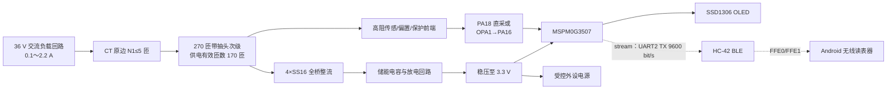
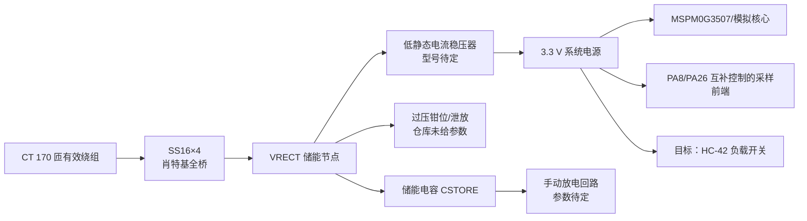
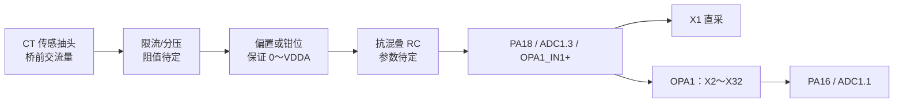
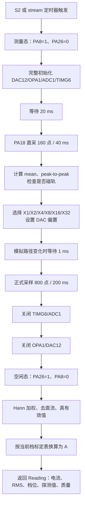
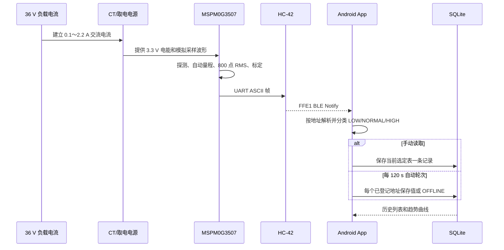

# “无源”交流电流表及无线读表器本地项目完整方案

> 文档性质：依据当前本地仓库中的题目整理、设计报告、Rust 固件、Android App 和 HC-42 手册提取。
>
> 提取日期：2026-07-31。
>
> 重要说明：本文将参数分为“源码已实现”“设计报告已确定”和“仓库未给出/待实测”三类。没有在工程中找到依据的磁芯型号、电容容量、电阻值等参数不会被虚构。
>
> 最新同步：已合入远端 `origin/main` 的 `81e2356`、`d444031`、`ae2b122` 三个提交，最新基线为 `ae2b122（蓝牙传输&自动calib）`。

## 1. 方案概述

本项目由两部分组成：

1. 电流表端：以电流互感器（CT）同时完成电磁耦合取电和交流电流传感，使用 SS16 肖特基全桥、储能与稳压电路建立 3.3 V 电源；MSPM0G3507 完成 ADC 采样、自动量程、真有效值计算和 OLED 显示，目标是通过 HC-42 BLE 串口模块发送数据。
2. 无线读表器端：使用 Android 手机扫描并连接一个或多个 HC-42，解析电流表数据，完成手动/自动采集、低限/超限/离线报警、SQLite 历史存储和趋势曲线显示。

系统目标链路如下：



### 1.1 当前实现状态

| 模块 | 当前仓库状态 | 说明 |
| --- | --- | --- |
| CT 绕组方案 | 设计报告已确定 | 初版 85 匝；改进版总计 270 匝并设抽头；报告称最终以 170 匝有效绕组供电 |
| SS16 全桥取电 | 设计报告已确定 | 四只 SS16；没有找到完整原理图和器件参数表 |
| 储能、稳压、放电 | 仅有结构设计 | 电容容量、稳压器型号、限压值和放电电阻/开关参数均未落定 |
| ADC、DMA、自动量程、RMS | 源码已实现 | Rust 裸机固件已经实现并可编译 |
| OLED 显示 | 源码已实现 | S2 触发一次测量，显示 1 s 后熄屏 |
| HC-42、地址拨码、UART 发帧 | `stream` 固件已实现 | `src/bin/stream.rs` 周期测量，经 PB15/UART2 向 HC-42 发送；PB0/PB6/PB7/PB8 每帧读取地址 |
| Android BLE 读表器 | 源码已实现 | 支持多设备、手动存档、自动周期存档、报警、SQLite 和趋势显示 |
| 低功耗关断 | 源码已实现 | 每次采样结束后依次关闭 TIMG6/ADC1、OPA1/DAC12，再让外部 AFE 返回空闲态 |
| 0.5% 精度标定 | 已有 X1 七点表，仍未完成验收 | X1 覆盖 0.0755～2.030 A；其余五档为空，低端和 2 A 以上仍需加密与独立验证 |
| 自动标定采集 | 工具已实现 | `tools/cal_log.py` 同时接收 BLE 帧并读取 SDM3055X-E，将配对结果逐行写入 CSV |
| 启动电流、启动时间、5 m 距离 | 待实测 | 仓库报告中没有有效实测结果 |

## 2. 题目约束与本方案对应关系

| 题目要求 | 本项目对应方案 | 当前结论 |
| --- | --- | --- |
| 电路 A、B 只能由电磁耦合供电 | CT 次级经 SS16 全桥、储能和稳压供电 | 结构满足，实物需核验不能存在 USB/调试器反向供电 |
| 初级绕组不超过 5 匝且可见 | 设计约束为 `N1 ≤ 5` | 仓库未记录实物最终采用 1～5 匝中的哪一个值 |
| 0.1～2 A，有效值误差不超过 0.5% | 六档自动量程、Hann 加权真有效值、分档标定 | 算法已实现、X1 已有七点表，0.5% 独立验收仍未完成 |
| 低启动电流、短启动时间 | 肖特基整流、外设按需供电、按键测量 | 稳压/储能参数和启动实测未完成 |
| 4 位地址开关 | PB0、PB6、PB7、PB8，低有效 | `stream` 每帧重新读取，运行中修改无需重启 |
| 电路 B 可插拔，拔除后电路 A 正常 | HC-42 位于受 PB17 负载开关控制的无线板 | 无线固件已实现；独立可插拔结构和拔除后的实物行为仍需确认 |
| 无线距离不小于 5 m | HC-42 BLE，最大射频功率默认 4 dBm | 待实测 |
| 每 2 min 自动采集 | App 默认周期 120 s | 已实现，可在 10～300 s 范围设置；验收应保持 120 s |
| 低限、超限、离线报警 | `<200 mA`、`>2000 mA`、无新鲜数据 | App 已实现 |
| 至少 30 条且掉电不丢失 | 手机 SQLite 保存最近 1000 条 | 已实现；卸载 App 会删除应用数据，不属于普通掉电 |

## 3. CT 与绕组设计

### 3.1 已知匝数

| 项目 | 工程记录值 | 状态 |
| --- | ---: | --- |
| 原边匝数 `N1` | `N1 ≤ 5` | 只有题目约束，未找到实物最终匝数 |
| 初版次级 `N2` | 85 匝 | 已被后续方案替代 |
| 改进版次级总匝数 | 270 匝 | 设计报告已记录 |
| 抽头安排 | 报告称每 50 匝预留抽头，末端保留完整 270 匝 | 需对照实物线头复核 |
| 最终供电有效匝数 | 170 匝 | 报告称经抽头对比后确定 |

这里存在一个必须在实物上核对的记录问题：“每 50 匝一个抽头”本身不能直接得到 170 匝端点，除非还存在 20 匝尾段、额外抽头或使用了两个抽头之间的组合。建议在最终文档和实物标签中明确写成类似：

```text
公共端 COM
T1 = ___ 匝
T2 = ___ 匝
T3 = ___ 匝
T4 = ___ 匝
T5 = ___ 匝
END = 270 匝
实际供电：COM 至 T? = 170 匝
实际传感：___ 至 ___ = ___ 匝
```

### 3.2 电流变换关系

忽略励磁电流、漏磁和绕组损耗时，原副边安匝平衡：

$$
N_1 I_1=N_2 I_2
$$

因此：

$$
I_2=\frac{N_1}{N_2}I_1
$$

若使用 170 匝作为有效次级，则理论变比取决于尚未确定的 `N1`：

| `N1` | `I2/I1` | `I1=0.1 A` 时理论 `I2` | `I1=2 A` 时理论 `I2` |
| ---: | ---: | ---: | ---: |
| 1 匝 | 1/170 | 0.588 mA | 11.76 mA |
| 2 匝 | 2/170 | 1.176 mA | 23.53 mA |
| 3 匝 | 3/170 | 1.765 mA | 35.29 mA |
| 4 匝 | 4/170 | 2.353 mA | 47.06 mA |
| 5 匝 | 5/170 | 2.941 mA | 58.82 mA |

以上仅是理想副边电流，不等于实际可用电流。真实取能能力还受磁芯截面积、磁导率、饱和磁通密度、绕组电阻、负载反射、整流导通角和稳压器效率影响。

### 3.3 匝数选择的影响

- 增大 `N1` 会提高同一线路电流下的安匝数和可获得能量，但题目限制最多 5 匝，同时增加了线路串接长度和制作难度。
- 增大 `N2` 有利于提高次级开路感应电压，但绕组铜阻、分布电容和绕制体积随之增加。
- 取电绕组接入整流和储能后不再处于开路状态，负载会反射到原边并改变波形，必须以带载电压和启动能力选择抽头，不能只比较空载电压。
- CT 次级不应在大电流下长时间开路；调试时应保留钳位或安全负载，避免高感应电压损坏器件。

### 3.4 仓库未给出的 CT 参数

以下项目必须根据实物补填，否则无法完成磁设计复算和复制制作：

| 参数 | 当前状态 | 建议记录方式 |
| --- | --- | --- |
| 磁芯型号、材质、尺寸 | 未给出 | 型号、外径/内径/高度、有效截面积 `Ae`、磁路长度 `le` |
| 初级实际匝数 | 未给出 | 直接数可见绕组并拍照 |
| 次级线径与漆包线规格 | 未给出 | 线径、温升、直流电阻 |
| 抽头准确匝数 | 记录不完整 | 用标签和万用表确认线头，形成抽头表 |
| 170 匝测试条件 | 未给出原始数据 | 至少记录 0.1/0.2/1/2 A 时空载电压、整流电压和带载电压 |
| 饱和与温升 | 未实测 | 2.2 A 连续工作波形、温升和失真 |

## 4. CT 取电电路

### 4.1 已确定的电路结构

设计报告确定采用单组带抽头次级，170 匝有效绕组驱动四只 SS16 构成的全桥整流，再接储能、稳压和负载分配：



桥式整流每半周有两只二极管串联导通。若次级瞬时电压为 `u2(t)`，单只 SS16 正向压降为 `VF`，整流节点近似为：

$$
u_r(t)=\max\left(|u_2(t)|-2V_F,0\right)
$$

选用 SS16 的目的，是在小电流、低次级电压时减小普通硅二极管约两倍正向压降造成的能量损失。

### 4.2 储能与启动计算

仓库没有给出储能电容容量。选值时应同时满足冷启动和一次工作脉冲所需能量。

电容从 `VHI` 放电到系统允许的最低电压 `VLO` 时可释放：

$$
E_C=\frac{1}{2}C\left(V_{HI}^2-V_{LO}^2\right)
$$

若一次测量和显示/发送阶段所需总能量为 `Ecycle`，考虑稳压效率 `η` 和裕量系数 `K`，应满足：

$$
C\geq\frac{2K E_{cycle}}{\eta\left(V_{HI}^2-V_{LO}^2\right)}
$$

若启动期间平均可获得功率为 `Pharvest`、负载平均消耗为 `Pload`，电容从 0 V 充到稳压器启动门限 `Vstart` 的理想时间近似为：

$$
t_{start}\approx\frac{C V_{start}^2}{2(P_{harvest}-P_{load})}
$$

这说明电容并非越大越好：容量变大可以跨越负载脉冲，却会延长低电流冷启动时间。最终应通过完全放电后的实测选择。

### 4.3 稳压器选择

设计报告只比较了 DC-DC 和 LDO，没有确定最终型号：

| 项目 | DC-DC | LDO |
| --- | --- | --- |
| 能量利用率 | 输入输出压差大时通常较高 | 近似为 `Vout/Vin` |
| 启动条件 | 受启动电压、冷启动电流和电感参数影响 | 结构简单，但要求输入高于输出加压差 |
| 静态电流 | 需要选低 IQ 器件 | 可选微安/亚微安级器件 |
| 模拟噪声 | 有开关纹波，需滤波和布局控制 | 通常更低 |
| 当前工程状态 | 待实测比较 | 待实测比较 |

正式选型至少应给出：启动电压、静态电流、最大输出电流、欠压锁定、输入耐压、效率曲线和输出纹波。由于 HC-42 引脚说明要求 3.3 V 电源具备不小于 50 mA 的供电能力，稳压和负载开关的瞬态额定值不能只按其 1.23 mA 典型平均电流设计。

### 4.4 外设电源管理

最新固件使用 PA8 和 PA26 作为一对互补控制线，二者只成对翻转：

| 状态 | PA8 | PA26 |
| --- | --- | --- |
| 空闲态 | 低 | 高 |
| 测量态 | 高 | 低 |

外部硬件必须分别为 PA8 配置下拉、为 PA26 配置上拉。MCU 从上电到固件接管 GPIO 之前，两脚处于输入/高阻状态；没有外部定态电阻时，采样前端可能在储能电源最弱的启动阶段进入不确定状态。

进入测量态后，固件在同一个 20 ms 建立窗口内完整初始化 DAC12、OPA1、ADC1 和 TIMG6；DAC 最大启动时间约 6.9 µs、OPA1 高增益模式使能时间约 6 µs，相比 20 ms 可忽略。主帧结束后按下游到上游顺序关断：

```text
停止 TIMG6并关闭 TIMG6/ADC1 PWREN
→ 关闭 OPA1，再释放并关闭 DAC12
→ PA26 拉高、PA8 拉低，使外部 AFE 回到空闲态
```

清除 PWREN 会复位各模拟模块寄存器，因此下一周期不是“恢复”，而是用上一周期保留在 RAM 中的量程和输入均值重新完整配置。

`stream` 无线固件已经恢复 PB17 控制 HC-42 的外部 3.3 V 负载开关：先在无线关闭状态完成第一次测量，再将 PB17 拉高，等待 350 ms 后才初始化 UART2。PB17 不应直接为 HC-42 供电，只能控制负载开关 EN，并需要外部下拉。

### 4.5 放电和保护

题目要求便于测试前释放残余电量。推荐结构为储能电容两端并联“按键/拨动开关 + 放电电阻”，而不是用导线直接短路。放电电阻需同时满足：

$$
\tau=R_{dis}C_{store}
$$

按约 `5τ` 后电压可下降到初值的 1% 以下；初始功耗为：

$$
P_{0}=\frac{V_{rect,max}^2}{R_{dis}}
$$

仓库未给出 `Rdis`、`Cstore` 和最高整流电压，因此目前不能给出安全阻值。还应在 VRECT 节点设置过压钳位，避免大电流或轻载时储能节点超过稳压器、MOSFET和电容耐压。

## 5. 电流传感与模拟前端

### 5.1 固件对传感信号的要求

当前固件要求外部前端向 PA18 提供一个始终位于 `VSSA～VDDA` 范围内、含交流分量的模拟信号。PA18 有两条采样路径：

1. X1 直通路径：ADC1 通道 3 直接读取 PA18；
2. X2～X32 路径：PA18 接 MSPM0G3507 内部 OPA1 的同相输入，OPA1 输出到 PA16，再由 ADC1 通道 1 采样。

OPA1 的内部拓扑为：

- `PSEL = EXTPIN1`：同相端取 PA18；
- `NSEL = OANRTAP`：反相端取内部电阻梯抽头；
- `MSEL = DAC12OUT`：电阻梯底部由片内 12 位 DAC 偏置；
- `GAIN = 2/4/8/16/32`；
- `OUTPIN = 1`：输出驱动 PA16。

其传递关系为：

$$
V_{out}=G V_{in}+(1-G)V_{DAC}
$$

若输入直流中心为 `Vin,dc`，期望输出落在 ADC 中点 `Vc`，则：

$$
V_{DAC}=\frac{G V_{in,dc}-V_c}{G-1},\quad G>1
$$

ADC 和 DAC 均为 12 位并共用 `VDDA/VSSA` 参考，因此源码直接在码值域计算，`Vc=2047`，DAC 码范围为 0～4095。

### 5.2 推荐的外部传感连接

本地报告写有“取电与传感共用整流链路”，但没有给出完整原理图；当前 RMS 固件则会减去帧内直流均值，并按交流波形计算有效值。因此实物必须确认送入 PA18 的到底是原始交流波形、带直流偏置的交流波形，还是全波整流波形。

与当前固件最直接兼容的结构是从 CT 抽头在整流桥之前高阻取样：



设计外部前端时需满足：

- 在 2.2 A、最不利抽头和最高储能电压下，PA18 不得低于 VSSA 或高于 VDDA；
- 输入阻抗应足够高，不能显著抢占取电功率，也不能改变 CT 的工作点；
- 必须有串联限流和对电源轨的钳位/保护；
- RC 截止频率要保留 50 Hz 基波和需要测量的畸变成分，同时衰减整流、DC-DC 和射频噪声；
- PA8/PA26 让外部前端回到空闲态时，PA18 不得通过保护二极管或信号线反向供电。

如果实物确实把全波整流后的波形直接送入 PA18，现有“减均值后 RMS”计算得到的是整流纹波的交流分量，不是原波形的标准真有效值。虽然分段标定可能在固定波形下映射回电流，但物理含义和对畸变负载的适应性会变差。正式定稿前应以示波器确认 PA18 波形，并统一原理图、报告和固件算法。

### 5.3 仓库中缺失的传感器件值

当前仓库没有找到以下确定参数：

- CT 传感抽头的准确匝数；
- 负载电阻/取样电阻；
- 分压电阻、偏置电阻；
- 输入限流和钳位器件；
- 抗混叠 RC；
- PA8/PA26 互补控制的模拟开关或负载开关型号；
- PA18 在 0.1 A、2.0 A 时的实测直流中心和峰峰值。

这些参数决定输入是否削顶、最低量程的信噪比和 0.5% 精度，必须从实物原理图或台架测量补入。

## 6. MSPM0G3507 与外围接口

### 6.1 当前公共测量核心和按键固件使用的引脚

| 引脚 | 当前功能 | 实现依据 |
| --- | --- | --- |
| PA8 | 外部采样前端正向控制，测量时高 | `src/meter.rs` |
| PA26 | 外部采样前端反向控制，测量时低 | `src/meter.rs`；必须断开 LaunchPad 跳线 J18，避免与板载光传感器电路对打 |
| PA18 | 原始模拟输入，OPA1_IN1+ / ADC1 通道 3 | `src/sampler.rs`、`src/range.rs` |
| PA16 | OPA1 输出 / ADC1 通道 1 | `src/sampler.rs`、`src/range.rs` |
| PB21 | LaunchPad S2，下降沿触发一次测量 | `src/main.rs` |
| PB2 | OLED 软件 I²C SCL | `src/oled.rs` |
| PB3 | OLED 软件 I²C SDA | `src/oled.rs` |
| PA0 | LaunchPad 红色 LED1，3 Hz 运行指示 | `src/led.rs`；会产生持续功耗，最低启动电流测试时应评估其影响 |
| DMA_CH0 | 搬运 ADC1 MEMRES0 | `src/sampler.rs` |
| TIMG6 | 4 kHz ADC 触发源 | `src/sampler.rs` |

### 6.2 `stream` 无线固件使用的引脚

以下引脚已经在 `src/bin/stream.rs` 中使用：

| 引脚 | 目标功能 | 说明 |
| --- | --- | --- |
| PB17 | HC-42 电源负载开关 EN | 高电平开启；必须外接负载开关和 EN 下拉 |
| PB15 | UART2 TX | 9600 bit/s，连接 HC-42 RXD；固件只发送不接收，PB16 保持空闲 |
| PB0、PB6、PB7、PB8 | 4 位地址开关 | 开关闭合接地，内部上拉后按低有效读为地址位 1 |

### 6.3 ADC、定时器与 DMA 配置

| 参数 | 源码值 |
| --- | ---: |
| MCU 总线/定时器时钟 | 32 MHz |
| TIMG6 装载值 | `32 MHz / 4 kHz - 1 = 7999` |
| ADC | ADC1，12 位，右对齐 |
| ADC 参考 | VDDA/VSSA |
| ADC 采样触发 | TIMG6 零事件，经 Event Fabric 通道 1 |
| DMA 触发号 | 24，ADC1 结果装载事件 |
| DMA 通道 | DMA_CH0 |
| 探测帧 | 160 点，40 ms，约 2 个 50 Hz 周期 |
| 正式帧 | 800 点，200 ms，约 10 个 50 Hz 周期 |

采样全程由 TIMG6→ADC1→DMA 硬件链路完成，CPU 无需逐点中断。DMA 等待设置了有界超时；若超时，当前帧会显示 `?` 标记，避免把新旧混合缓冲区当成有效数据。

## 7. 电流表固件设计

### 7.1 软件结构

Rust 固件采用 `no_std`、`no_main`，基于 Embassy MSPM0，主要模块如下：

| 文件 | 职责 |
| --- | --- |
| `src/main.rs` | 按键测量固件入口：S2 触发、OLED 显示 |
| `src/bin/stream.rs` | 无线固件入口：周期测量、地址读取、HC-42 发帧 |
| `src/meter.rs` | 两套固件共用的一次完整测量：AFE 控制、模拟模块上电/掉电、采样、RMS 和标定 |
| `src/sampler.rs` | TIMG6、ADC1、DMA、探测和正式采样缓冲区 |
| `src/range.rs` | OPA1、DAC 偏置、X1～X32 自动量程与回差 |
| `src/dsp.rs` | Hann 表、去直流真有效值、可选工频估计和噪声扩展量 |
| `src/cal.rs` | 六档标定表和分段线性插值 |
| `src/dac.rs` | 片内 DAC12 初始化和码值设置 |
| `src/oled.rs` | PB2/PB3 软件 I²C 和 SSD1306 驱动 |
| `src/ui.rs` | OLED 初始化重试、读数显示和质量标志 |
| `src/led.rs` | PA0 红色 LED1 的 3 Hz 运行指示任务 |
| `src/bin/oparails.rs` | 台架扫描 OPA1 输出摆幅，复核 ADC/OPA 可用窗口 |
| `tools/cal_log.py` | BLE 与标准万用表同步采集，输出标定 CSV |

### 7.2 两套固件入口

当前不是一套固件同时完成 OLED 和无线，而是两个可执行目标共用同一个 `Meter::measure()`：

| 固件 | 触发方式 | 输出 | 构建/运行命令 |
| --- | --- | --- | --- |
| 默认 `main` | PB21/S2 下降沿，一按一测 | OLED 显示 1 s | `cargo run --release` |
| `stream` | 上电先测一次，之后定时循环 | HC-42/UART2 | `cargo run --release --bin stream` |

两者共享完全相同的模拟上电、探测、自动量程、正式采样、掉电、RMS 和查表流程，因此同一套 CAL 表可用于两者。需要注意，当前不能同时刷入两套固件；正式作品如果既要求本地按键显示又要持续无线报数，还需合并两个入口的上层逻辑。

### 7.3 当前一次测量流程



不含 MCU 上电和储能建立时间，一次按键到采样完成的固定时间约为：

```text
20 ms 前端建立 + 40 ms 探测 + 最多 1 ms 换档建立 + 200 ms 正式采样
≈ 260～261 ms，再加计算和 OLED 刷新时间
```

`stream` 中的 `PERIOD_MS=1000 ms` 是一次发送后的空闲等待时间；等待结束后才执行下一次约 260 ms 的测量，所以帧到帧实际周期约为 1.26 s 加少量运算/串口时间，而不是严格 1.000 s。空闲期间模拟链路均掉电，HC-42 保持供电，因为远端无法唤醒已经断电的 BLE 外设。

### 7.4 自动量程

量程集合为：

```text
X1（PA18 直采）、X2、X4、X8、X16、X32（OPA1）
```

探测帧先以 X1 读取输入均值 `mean_in` 和峰峰值 `pp_in`。算法估算当前档的直流中心和交流半幅，选择能在可用摆幅内工作的最高增益档。

- ADC/OPA 统一窗口：0～4095 LSB；
- 目标填充率：可用半边余量的 65%；
- 当前档高于 75% 时允许降档；
- 当前档低于 25% 时允许升档；
- X1 是所有 OPA 档都无法容纳时的兜底直采路径；
- 探测样本出现 0 或 4095 时标记输入碰轨，不继续依据错误幅值换档。

回差的作用是避免输入停在换档门限附近时来回切换。由于每一档使用独立标定表，频繁换档会把相邻标定表的残余差异表现为显示跳变。

### 7.5 Hann 加权真有效值

对一帧 `N=800` 点样本 `x[n]` 使用周期型 Hann 窗：

$$
w[n]=\frac{1}{2}\left(1-\cos\frac{2\pi n}{N}\right)
$$

先求加权直流分量：

$$
\bar{x}_w=\frac{\sum_{n=0}^{N-1}w[n]x[n]}{\sum_{n=0}^{N-1}w[n]}
$$

再求去直流后的有效值码宽：

$$
X_{rms}=\sqrt{\frac{\sum_{n=0}^{N-1}w[n]\left(x[n]-\bar{x}_w\right)^2}
{\sum_{n=0}^{N-1}w[n]}}
$$

源码采用两遍计算：第一遍计算加权均值，第二遍计算残差平方和，避免使用 `E[x²]-E[x]²` 时两个大数相减造成单精度浮点有效位损失。Hann 窗用于减小帧长不是严格整数工频周期时二倍频泄漏对 RMS 的影响。

### 7.6 标定

每个量程都应建立独立的 `(RMS LSB, 标准电流 A)` 表，并按 RMS 和电流同时严格递增。相邻点间使用分段线性插值：

$$
I=I_k+\frac{X_{rms}-x_k}{x_{k+1}-x_k}(I_{k+1}-I_k)
$$

表外使用首段或末段外推，避免 2 A 以上被错误钳位而无法触发超限报警。

最新代码已经在 X1 直采档写入七个实测点：

| RMS/LSB | 标准电流/A |
| ---: | ---: |
| 18.34 | 0.0755 |
| 35.81 | 0.191 |
| 129.07 | 0.530 |
| 144.41 | 0.707 |
| 185.50 | 1.040 |
| 269.18 | 1.505 |
| 441.40 | 2.030 |

台架记录显示当前前端实际一直工作在 X1；X2、X4、X8、X16、X32 五张表仍为空。空表暂时使用：

```text
CAL_FALLBACK_A_PER_LSB = 0.0047436945
CAL_FALLBACK_GAIN      = 1.0
```

该回退系数是对七个 X1 点按相对误差、过原点最小二乘得到，代码注释给出的最坏误差仍约 15.5%，只能用于没有标定表的 PGA 档调试，不能证明 0.5% 精度。

现有 X1 表还有两个明显不足：0.191～0.530 A 之间过稀，正好覆盖 CT 低磁通比差变化较大的区域；最高点仅到 2.030 A，2.03 A 以上超限区需要末段外推。仍需在 0.1 A 附近、低端曲率区、换档重叠区和 2.0～2.2 A 补点，并用不参与拟合的独立点验证。

建议标定点：

| 区域 | 建议标准电流点 |
| --- | --- |
| 低端重点 | 0.10、0.12、0.15、0.18、0.20、0.25、0.30 A |
| 中段 | 0.40、0.50、0.75、1.00 A |
| 高段 | 1.25、1.50、1.75、2.00、2.10、2.20 A |
| 换档重叠区 | 以实物实际换档点为中心，在两侧加密 |

### 7.7 BLE—标准表自动采集工具

新增的 `tools/cal_log.py` 用于自动获取标定原始数据，而不是自动把结果写回 `src/cal.rs`。其工作过程为：

1. 使用 Bleak 扫描并连接 HC-42，订阅 FFE1；
2. 收到一次测量的 `METER_TEST` 与 `METER_CAL` 两行后，在默认 0.15 s 窗口内合并为一条记录；
3. 同时通过 USB-TMC/VISA 或 TCP 5025 向 SDM3055X-E 发送 `READ?`；
4. 将时间、标准电流、读取延迟、RMS、档位、地址、mean、pp、状态和原始帧逐行追加到 CSV；
5. 每写一行立即 `flush`，中途断电或退出时已写数据不会因缓冲丢失。

Python 环境要求 3.14，依赖 `bleak`、`pyusb`、`pyvisa` 和 `pyvisa-py`，由 `pyproject.toml`/`uv.lock` 管理。示例：

```bash
uv run python tools/cal_log.py --list
uv run python tools/cal_log.py --list-dmm
uv run python tools/cal_log.py --out cal-x1.csv
```

运行时空格暂停/继续，`q` 退出。脚本当前直接使用 `termios`/`tty`，更偏向 macOS/Linux；若在 Windows 原生 Python 下运行，需要替换键盘输入部分或使用兼容环境。

仓库自带的 `cal.csv` 有 91 行采集记录，其中 89 行 `FLAG=OK`、2 行 `FLAG=BAD_INPUT`，均为地址 15、X1 档，标准表读数范围约 0.586～3.498 A，BLE 帧到标准表读数完成的延迟为 151～152 ms。这是一份采集日志，不是 0.5% 验收结论；异常点、负载变化和超出题目 2.2 A 的记录必须在拟合前筛选。

## 8. OLED 与人机交互

OLED 为 SSD1306 128×64，PB2/PB3 使用软件 I²C。驱动时序按 SSD1306 要求实现 ACK 检查，并允许本次上电最多尝试初始化 4 次，原因是首次按键时储能电源可能仍偏弱。

当前显示逻辑：

- 上电不初始化 OLED，避免启动瞬态负担；
- 按 S2 后完成一次测量；
- 第一行显示 `!`、`>` 或 `?` 异常标记以及三位小数电流；
- 第二行显示原始 `rms` LSB 和当前增益，供标定使用；
- 显示 1 s 后发送显示关闭命令。

此外，PA0 板载红色 LED1 从固件启动后以 3 Hz 闪烁，用来区分“OLED 正常待机熄屏”和“系统未上电/固件卡死”。它由独立 Embassy 任务驱动，测量期间仍继续闪烁。该 LED 有持续耗电，若目标是压低最低启动电流，应实测比较保留、降低占空比或断开 J4 的影响，并确保最终演示状态与报告一致。

异常标记含义：

| 标记 | 含义 |
| --- | --- |
| `!` | X1 探测已经碰到 ADC 端点，外部模拟输入越界 |
| `>` | 按幅值预测即使当前最低要求档也会削顶 |
| `?` | 探测或正式 DMA 采样未完整结束，缓冲区不可信 |

## 9. HC-42 无线硬件

### 9.1 模块参数

依据仓库中的 `docs/HC42.pdf`：

| 项目 | 参数 |
| --- | --- |
| 协议 | Bluetooth 5.0 BLE |
| 频段/调制 | 2.4 GHz ISM / GFSK |
| 工作电压 | 1.8～3.6 V，推荐 3.3 V |
| UART 电平 | 与工作电压一致，1.8～3.6 V |
| 默认 UART | 9600 bit/s |
| 最大发射功率 | 4 dBm |
| 接收灵敏度 | -96 dBm@1 Mbps |
| 全速广播/连接参考电流 | 约 1.23/1.22 mA，不含 LED |
| 低功耗广播/连接参考电流 | 约 75/65 µA，不含 LED，随广播间隔变化 |
| 停机电流 | 约 0.3 µA |
| 模块启动等待 | 手册建议上电或复位至少 350 ms 后再操作 UART |
| BLE Service | FFE0 |
| 透传 Notify Characteristic | FFE1 |

HC-42 连接关系：模块 RXD 接 MCU TXD，模块 TXD 接 MCU RXD，电源为受控 3.3 V。模块天线端应靠近板边，天线下方不敷铜、不走线，最好挖空底板铜皮。

### 9.2 低功耗建议

- 关闭模块板载 LED，避免指示灯电流超过 BLE 核心功耗；
- 如保持模块常供电，可使用 `AT+SLEEP`/`AT+PM=1` 和 LPIN 控制低功耗；
- 如使用断电控制，应避免 UART TX 在模块断电时保持高电平而经 RXD 保护二极管反向灌电；
- 上电等待 350 ms 后再初始化/发送 UART；
- 5 m 验收时固定射频功率、手机位置和天线方向，记录测试条件。

### 9.3 当前无线固件行为

`src/bin/stream.rs` 已实现完整发射侧：

- PB17 低电平保持 HC-42 断电；
- 先完成第一轮测量，避免无线启动浪涌和首次测量争夺储能；
- PB17 拉高后等待 350 ms；
- UART2 只初始化 TX，PB15 以 9600 bit/s 连接 HC-42 RXD，PB16 不占用；
- PB0/PB6/PB7/PB8 每帧读取 4 位地址；
- 每轮发送手机帧和标定帧，再空闲 1000 ms 后测量下一轮；
- HC-42 一旦开启便保持供电，模拟采样模块则在每次测量后全部关闭。

当前剩余的软件结构缺口是默认 `main` 只有 OLED、`stream` 只有 BLE，两者不能在同一固件中同时运行。正式作品若要求本地显示和无线模块同时可用，应新增统一入口，调用同一个 `Meter::measure()` 后同时交给 `Panel` 和 `transmit()`，并重新核算能量预算。

## 10. 无线通信协议

Android App 当前解析的帧格式为：

```text
METER_TEST,ADDR=01,CURRENT_MA=1234,STATUS=NORMAL\r\n
```

| 字段 | 格式和范围 | 说明 |
| --- | --- | --- |
| 帧头 | `METER_TEST` | 固定字符串 |
| `ADDR` | 1～2 位十进制，App 校验 0～15 | 对应 4 位编码开关 |
| `CURRENT_MA` | 1～7 位非负十进制 | 电流有效值，单位 mA |
| `STATUS` | 大写字母/下划线 | 当前 App 能解析，但最终报警状态由手机按电流重新判定 |
| 结束符 | `\r\n` | App 按换行切帧，能处理 BLE 通知拆包/粘包 |

解析缓冲最大 2048 字符；格式错误、地址越界或负数会被丢弃。当前协议没有 CRC、序号和电表时间戳，依赖 BLE GATT 传输完整性并由手机接收时刻作为记录时间。若后续加入 CRC，应同步修改 App，不能只改电流表端。

无线固件还会紧接着发送一行标定帧：

```text
METER_CAL,ADDR=15,RMS=193.36,GAIN=1,FLAG=OK,MEAN=395,PP=662\r\n
```

| 字段 | 说明 |
| --- | --- |
| `RMS` | Hann 加权有效值原始码宽 |
| `GAIN` | 当前实际量程倍数 1/2/4/8/16/32 |
| `FLAG` | `OK`、`BAD_INPUT`、`OVER` 或 `PARTIAL` |
| `MEAN`、`PP` | X1 探测帧的输入均值和峰峰值；探测失败时省略 |

Android 的正则只接受完整 `METER_TEST` 行，因此不能把标定字段追加到手机帧末尾；额外 `METER_CAL` 行会被手机忽略，由台架工具解析。

质量处理策略：`Good` 正常发送；`OverRange` 虽然数值可能偏低，但方向确定，仍以 `STATUS=HIGH` 发送；`InputBad` 和 `Incomplete` 不发送 `METER_TEST`，让手机最终按无帧判离线，但仍发送带故障标志的 `METER_CAL` 供调试。

## 11. Android 无线读表器软件

### 11.1 工程结构

Android 工程位于 `android-reader/`，使用 Java 原生界面和自绘仪表盘，主要模块：

| 文件 | 职责 |
| --- | --- |
| `MainActivity.java` | 权限、前台服务控制、界面与数据库协调 |
| `MeterPollingService.java` | BLE 扫描、多链路连接、订阅、重连、自动存档 |
| `MeterFrameParser.java` | ASCII 流式切帧和字段校验 |
| `MeterDatabase.java` | SQLite 表、查询、裁剪和掉电保存 |
| `MeterReading.java` | 读数模型和状态分类 |
| `ReaderPreferences.java` | 自动采集间隔持久化 |
| `MeterDashboardView.java` | 16 地址仪表盘、手动读取、报警反馈、历史和趋势界面 |
| `TrendView.java` | 独立趋势图控件；当前主仪表盘也含自绘趋势区域 |

### 11.2 BLE 扫描和多设备连接

App 启动后申请 BLE 权限并启动前台服务。扫描采用 8 s 开、12 s 停的循环，候选设备名满足任一条件：

```text
包含 HC-42、HC42、METER、AMMETER，或以 BYJX_ 开头
```

发现设备后按 MAC 建立独立链路状态机，发现 FFE0 服务并订阅 FFE1 通知。连接失败 3 次前按约 1.5 s 重试，连续失败后放慢到约 10 s。

考虑部分手机同时只能稳定维持约 7 条 GATT 连接，App 设定最大活跃链路为 7；电表更多时轮换连接，每台至少驻留 4 s 且取得过有效帧后才轮出。轮歇表最近 120 s 内的数据仍可视为在场，避免多表轮转时误判离线。

### 11.3 基本模式

BLE 链路始终接收实时帧，但实时帧只更新界面，不自动写入数据库。用户在基本模式执行手动读取后，界面从选定地址抓取当前有效帧并写入一条 `source=MANUAL` 的记录。

这符合“允许操作读表器、不操作电流表”的一对一手动读取要求，但前提是电流表本身持续发送或至少在用户读取窗口内发送。当前一按一测固件需要人工操作电流表，因此与题目基本模式仍不闭环。

### 11.4 自动模式

自动模式一键启动后立即存一轮，然后按设置周期重复。默认周期为 120 s，允许设置 10、30、60、120、180、240 或 300 s；设置保存在 SharedPreferences 中。

每轮对“已登记地址 ∪ 当前有新鲜帧的地址”各保存一条：

- 普通已连接链路最近 1.5 s 内有帧：保存最新电流；
- 被轮歇的健康链路最近 120 s 内有帧：保存最新电流；
- 已登记但无可用帧：保存 `OFFLINE`，电流值为 -1。

正式验收应把周期固定为题目要求的 120 s，并展示一键启动、自动搜索和多表逐轮存档。

### 11.5 报警

状态由手机根据电流值重新计算：

| 条件 | 状态 |
| --- | --- |
| `I < 200 mA` | `LOW` |
| `200 mA ≤ I ≤ 2000 mA` | `NORMAL` |
| `I > 2000 mA` | `HIGH` |
| 已登记电表没有新鲜帧 | `OFFLINE` |

界面会对低限和超限产生视觉提示、振动和系统报警铃声，同一地址的响铃/振动设置了 10 s 冷却。离线会显示灰色离线状态并写入数据库；当前代码是否需要对离线也发出同等级声音报警，应按现场演示要求确认。

### 11.6 SQLite 数据与掉电保护

数据库文件为：

```text
wireless_meter_reader.db
```

主要表：

```sql
meters(
  address INTEGER PRIMARY KEY,
  mac TEXT NOT NULL UNIQUE,
  name TEXT NOT NULL,
  last_seen INTEGER NOT NULL
)

readings(
  id INTEGER PRIMARY KEY AUTOINCREMENT,
  timestamp INTEGER NOT NULL,
  address INTEGER NOT NULL,
  current_ma INTEGER NOT NULL,
  status TEXT NOT NULL,
  mac TEXT NOT NULL,
  device_name TEXT NOT NULL,
  rssi INTEGER NOT NULL,
  source TEXT NOT NULL
)
```

每次手动或自动存档均通过 SQLite `insertOrThrow` 立即写入持久存储，随后删除超过最近 1000 条之外的旧记录。数据不依赖 Activity 内存，手机关机、重启或 App 进程被系统结束后仍可重新查询，满足普通掉电保护要求。

需要注意：

- `android:allowBackup="false"`，不会通过 Android 备份迁移到另一台手机；
- 卸载 App、清除应用数据或恢复出厂设置会删除数据库；
- “清空历史”使用数据库事务同时删除 `readings` 和 `meters`；
- 掉电验收应先存入不少于 30 条，关机重启，再确认历史和趋势仍存在。

## 12. 完整软硬件闭环

完成后的端到端工作过程应为：



当前 `stream` 与 Android 已经形成“周期测量→UART→HC-42→FFE1→App→SQLite”的无线闭环。尚未闭合的是“同一个正式固件同时具备本地 OLED 按键显示和持续无线读表”：默认 `main` 和 `stream` 目前是二选一烧录。合并时应保持 `Meter::measure()` 不变，避免标定条件发生变化。

## 13. 建议的最终硬件 BOM 表

以下表格只填入仓库能够确认的器件；空缺项需根据实物补齐：

| 模块 | 器件/参数 | 数量 | 当前状态 |
| --- | --- | ---: | --- |
| 主控 | MSPM0G3507 | 每表 1 | 已确定 |
| CT 磁芯 | 型号、材质、尺寸待补 | 每表 1 | 未记录 |
| CT 原边 | `N1≤5`，实际匝数待补 | 每表 1 组 | 未记录 |
| CT 次级 | 270 匝带抽头，170 匝供电 | 每表 1 组 | 报告已记录，抽头需复核 |
| 整流 | SS16 | 每表 4 | 已确定 |
| 储能 | `CSTORE=___`、耐压 `___` | 每表 1 | 未记录 |
| 稳压 | DC-DC/LDO 型号 `___`，3.3 V | 每表 1 | 未确定 |
| 过压保护 | TVS/齐纳/钳位 `___` | 每表 1 组 | 未记录 |
| 放电 | 开关 + `RDIS=___` | 每表 1 组 | 结构要求已知，参数未定 |
| 传感输入 | 分压/限流/偏置/RC `___` | 每表 1 组 | 未记录 |
| AFE 开关 | PA8/PA26 互补控制的模拟/负载开关 `___` | 每表 1 组 | 固件接口已确定，型号未记录；PA8 下拉、PA26 上拉 |
| 显示 | SSD1306 128×64 OLED | 每表 1 | 已确定 |
| 按键 | S2，PB21 低有效 | 每表 1 | 已确定 |
| 地址开关 | 4 位编码/DIP 开关 | 每表 1 | 目标方案已确定 |
| 无线模块 | HC-42 BLE 独立可插拔板 | 每表 1 | 已确定 |
| 蓝牙电源开关 | PB17 控制，型号 `___` | 每表 1 | `stream` 已使用，型号未记录；EN 需外部下拉 |
| 运行指示 | PA0/LED1，3 Hz | 每表 1 | 已实现；需评估持续功耗 |
| 读表器 | Android 手机/平板 | 1 | App 已实现 |

## 14. 调试与验收流程

### 14.1 上电前检查

1. 核对 N1 实际匝数不超过 5，绕组可见。
2. 用电阻档确认 CT 各抽头，建立准确匝数—线头表。
3. 检查储能节点、电容和稳压器耐压。
4. 检查 HC-42 无法从 UART 或调试器反向取电。
5. 分别烧录/测试默认按键固件和 `stream` 无线固件；拔除无线模块后，确认电路 A 的测量核心不受影响。
6. 确认调试器/USB 断开后，电流表端只有 CT 电磁耦合供电。
7. 使用 PA26 前必须断开 LaunchPad J18，防止输出与板载光传感器电路冲突。

### 14.2 取电与启动测试

每次测试先使用放电回路将储能电压降到统一初值。记录：

| 线路电流/A | CT 抽头/匝 | 整流峰值/V | 储能稳态/V | 3.3 V 是否稳定 | 首次有效显示/ms | 首帧 BLE/ms |
| ---: | ---: | ---: | ---: | --- | ---: | ---: |
| 0.10 | 170 |  |  |  |  |  |
| 0.20 | 170 |  |  |  |  |  |
| 0.50 | 170 |  |  |  |  |  |
| 1.00 | 170 |  |  |  |  |  |
| 2.00 | 170 |  |  |  |  |  |
| 2.20 | 170 |  |  |  |  |  |

最低启动电流的判据应是能够稳定完成采样、计算、显示和题目要求的无线工作，而不是只看到储能电压或 MCU LED 亮。

### 14.3 传感波形检查

在 PA18、PA16、VRECT 和 3.3 V 同时观察：

- PA18 波形类型是否和算法一致；
- 0.1 A 时峰峰值是否足够大、噪声是否过高；
- 2.2 A 时 PA18/PA16 是否碰到 0 或 VDDA；
- 换档后 1 ms 是否足够稳定；
- PA8 高、PA26 低进入测量态后 20 ms 时，启动尾巴是否低于 1 LSB；
- 主帧结束后 TIMG6/ADC1、OPA1/DAC12 是否真正掉电，PA18 是否回到高阻；
- SS16 充电脉冲、DC-DC 纹波和 BLE 发射是否串入采样。

### 14.4 精度标定

1. 使用至少 4½ 位且分辨率不大于 1 mA 的标定表。
2. 可在 OLED 同时读取标准电流、`rms` LSB 和当前档位，也可烧录 `stream` 并用 `tools/cal_log.py` 自动配对 BLE 与 SDM3055X-E 数据。
3. 每档至少录入两个点，低电流和换档重叠区应加密。
4. 写入 `src/cal.rs` 对应表，重新编译烧录。
5. 用独立测试点而非全部使用标定点验证误差。
6. 每点重复至少 5 次，记录平均值、最大绝对相对误差和温升影响。

相对误差：

$$
\delta=\frac{I_x-I_{ref}}{I_{ref}}\times100\%
$$

全量程要求：

$$
|\delta|\leq0.5\%
$$

### 14.5 无线和 App 验收

1. 烧录 `stream`，确认电流表端持续产生 `METER_TEST` 和 `METER_CAL`；App 应解析前者并忽略后者。
2. 距离设为至少 5 m，记录遮挡、方向和 RSSI。
3. 基本模式只操作手机，抓取指定电表一条读数。
4. 自动模式一键启动，保持 120 s 周期并验证多个地址。
5. 调整电流到 `<0.2 A`、正常区和 `>2 A`，确认状态和报警。
6. 断开负载或停止某表发帧，确认离线记录。
7. 保存至少 30 条记录，检查时间、地址、电流、状态、历史和趋势。
8. 手机关机重启后重新打开 App，确认 SQLite 数据仍存在。

## 15. 当前必须补齐的问题

按优先级排序：

1. **合并正式固件入口**：当前 `main` 负责 OLED、`stream` 负责 BLE，尚不能同一固件同时演示两者。
2. **确认传感节点**：明确 PA18 是桥前交流、偏置交流还是整流后波形，避免硬件与 RMS 算法不一致。
3. **补齐原理图参数**：磁芯、N1、线径、抽头、CSTORE、稳压器、过压钳位、放电、传感分压/滤波和负载开关。
4. **解释 170 匝连接**：把“270 匝、每 50 匝抽头、最终 170 匝”的实际线头关系写清楚。
5. **完善标定**：X1 已有七点，但 0.191～0.530 A 过稀、2.03 A 以上不足，PGA 五档仍为空；必须完成独立误差验证。
6. **验证能量闭环**：0.1 A 下同时运行测量、3 Hz LED、OLED 和无线时能否稳定，不能只测空载储能电压。
7. **核对 PA26 硬件**：断开 J18，并验证 PA8 下拉、PA26 上拉及互补切换不会短时对打。
8. **防止外部供电违规**：正式测试时断开 LaunchPad USB/调试电源，并检查 UART、OLED 和手机附件不存在额外供电路径。
9. **补齐实测数据**：最低启动电流、冷启动时间、全量程误差、5 m 距离、双表互不影响和掉电保存。

## 16. 本文提取依据

| 来源 | 提取内容 |
| --- | --- |
| `docs/B题_无源交流电流表及无线读表器.md` | 赛题约束和验收指标 |
| `output/report/ZJA012_无源交流电流表及无线读表器_B题_v2.2.tex` | 270/170 匝、SS16、目标系统结构和测试状态 |
| `STRUCTURE.md` | DSP、双控制线掉电、双固件入口和 Android 需求 |
| `src/main.rs` | 当前一按一测、S2 和 OLED 入口 |
| `src/bin/stream.rs` | 周期测量、PB17/HC-42、地址读取、双帧发送 |
| `src/meter.rs` | PA8/PA26、共用测量周期、模拟模块完整上电/掉电和质量状态 |
| `src/sampler.rs` | TIMG6、ADC1、DMA、采样率和帧长 |
| `src/range.rs` | OPA1/DAC 拓扑、六档自动量程和回差 |
| `src/dsp.rs` | Hann 加权真有效值算法 |
| `src/cal.rs`、`data.csv` | X1 七点标定、其余空表和回退系数 |
| `src/oled.rs` | SSD1306 和软件 I²C |
| `src/ui.rs`、`src/led.rs` | OLED 显示层和 PA0 运行指示 |
| `tools/cal_log.py`、`cal.csv` | BLE—SDM3055X-E 自动配对采集和样例日志 |
| `pyproject.toml`、`uv.lock` | Python 3.14 标定工具环境 |
| `docs/HC42.pdf` | HC-42 电气、UART、BLE UUID、功耗与启动参数 |
| `android-reader/app/src/main/...` | BLE 服务、协议解析、SQLite、报警和 UI 实现 |
| Git 提交 `81e2356`、`d444031`、`ae2b122` | 模拟掉电、测量周期重构、无线传输和自动标定采集更新 |
